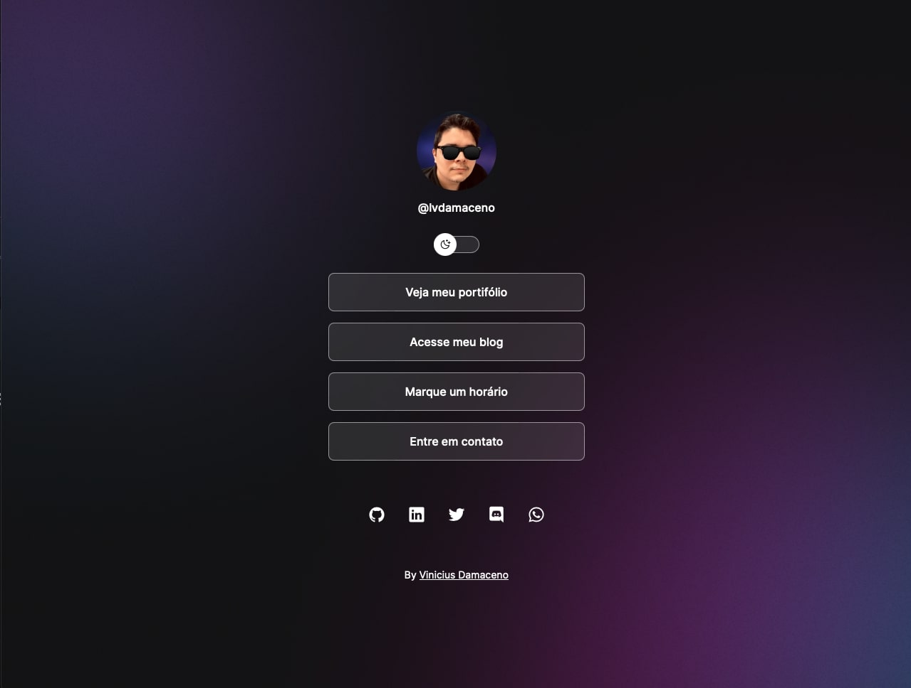

<h1 align="center"> About Me </h1>

Um agregador de links para usar como cartão de visitas online.

  <a href="#-tecnologias">Tecnologias</a>&nbsp;&nbsp;&nbsp;|&nbsp;&nbsp;&nbsp;
  <a href="#-projeto">Projeto</a>&nbsp;&nbsp;&nbsp;|&nbsp;&nbsp;&nbsp;
  <a href="#-layout">Layout</a>&nbsp;&nbsp;&nbsp;|&nbsp;&nbsp;&nbsp;
  <a href="#memo-licença">Licença</a>

  

 

  

## 🚀 Tecnologias

Esse projeto foi desenvolvido com as seguintes tecnologias:

- HTML e CSS
- JavaScript
- Git e Github
- Figma

## 💻 Projeto

Um agregador de links para usar como cartão de visitas online.

## 🔖 Layout

Você pode visualizar o layout do projeto através [DESSE LINK](<https://www.figma.com/file/FNECARj363neaIO6nuQE2R/DevLinks-(Community)?node-id=1%3A13&t=vLt6M9sQBDiNBIul-0>). É necessário ter conta no [Figma](https://figma.com) para acessá-lo.

## Como conectar um domínio .dev ao github pages

Passo a passo: https://lvdamacenoblog.wordpress.com/2023/01/29/custom-domain-no-github-pages/

## :memo: Licença

Esse projeto está sob a licença MIT.

---

by Vinícius Damaceno
